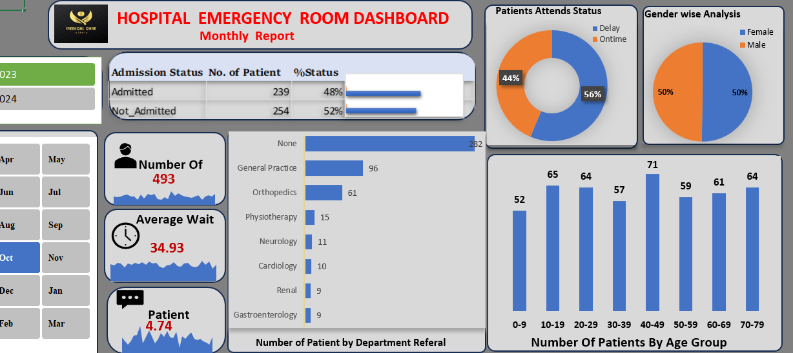

# Hospital-Emergency-Room-Data
Project Overview

The Hospital Emergency Room Analysis Dashboard is a healthcare analytics project designed to monitor and evaluate emergency room operations using patient data. The dashboard provides valuable insights into patient flow, waiting times, admission rates, satisfaction scores, demographics, and department referrals.

The primary objective of this project is to help hospital administrators and healthcare professionals make data-driven decisions that improve patient care, optimize resource allocation, and enhance operational efficiency.

Business Problem:

Emergency departments often experience challenges such as:

Long patient waiting times
Resource allocation issues
Overcrowding
Low patient satisfaction
Difficulty tracking admission trends
Limited visibility into departmental workload

Project Objectives:
Analyze emergency room patient volume.
Monitor patient waiting times.
Evaluate patient satisfaction levels.
Track admission and non-admission rates.
Understand patient demographics.
Analyze department referral patterns.
Identify operational bottlenecks.
Support healthcare management with actionable insights.

Tools & Technologies Used:
Microsoft Excel
Pivot Tables
Pivot Charts
Dashboard Design
Data Cleaning
Data Transformation
Data Visualization

Key Performance Indicators (KPIs)

The dashboard focuses on the following KPIs:
>Total Patient Records
>Average Waiting Time
>Patient Satisfaction Score
>Admission Rate
>Not Admitted Patients
>Daily Patient Trends:
Tracks patient volume over time.
Helps identify peak operational periods.

Dashboard Features:
1️) Patient Volume Analysis
Provides an overview of:
Total patient visits
Daily trends
Monthly patterns
Year-over-year comparison

2️) Waiting Time Analysis:
Monitors:
Average waiting time
Delayed attendance
Service efficiency

3️) Patient Satisfaction Analysis:
Evaluates:
Satisfaction trends
Service quality performance
Patient experience indicator

4️) Admission Analysis
Tracks:
Admitted patients
Non-admitted patients
Admission percentages

5️) Demographic Analysis
Breakdown by:
Gender
Age Group
Race

6️) Department Referral Analysis
Identifies workload distribution across:
General Practice
Orthopedics
Cardiology
Neurology
Gastroenterology
Renal
Physiotherapy

Key Insights:

> Patient Distribution
> Waiting Time Performance
> Admission Trends
> Patient Satisfaction

Business Recommendations
1) Reduce Waiting Time
Improve patient triage processes.
Increase staffing during peak hours.
Optimize patient flow management.
2) Improve Patient Satisfaction
Enhance communication with patients.
Reduce treatment delays.
Improve service quality monitoring.
3) Optimize Resource Allocation
Allocate resources based on peak patient volumes.
Monitor department utilization regularly.
4) Strengthen Department Planning
Increase support for highly utilized departments.
Forecast demand using historical trends.
5) Implement Real-Time Monitoring
Develop real-time operational dashboards.
Track emergency room KPIs continuously.

Project Outcome:
This project successfully transformed raw hospital emergency room data into actionable insights. The dashboard enables healthcare decision-makers 

Monitor operational performance
Improve patient care quality
Reduce waiting times
Optimize resource utilization
Enhance patient satisfaction
Support strategic healthcare planning

 Dashboard Preview

## Author
   Akshada Raut.

